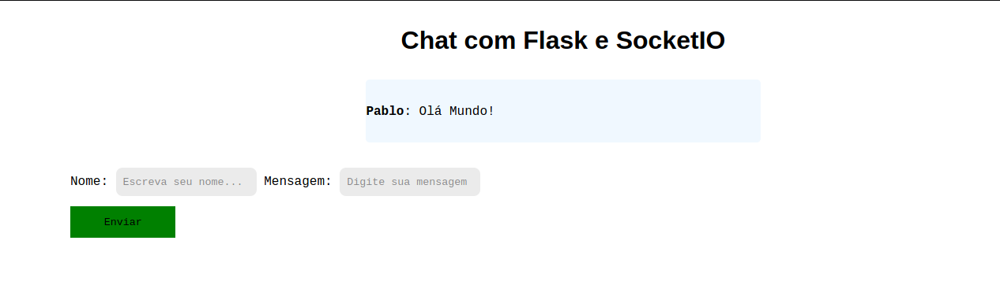

# Chat
---

## Descrição

O projeto deste repositório é um **Chat** de comunicação. 
Utilizando um ou mais navegadores é possível simular uma 
sala de comunicação entre pessoas. Este projeto é uma derivação
do projeto  *Criando Chat Com Flask-Socketio* do Marcus Pereira,
instrutor na *Spacedevs*. Segue informações do projeto original, 
não esqueça de curtir e deixar seu *joinha*:

- Github: https://github.com/Spacedevsd/chat-com-flask 
- Vídeo: https://youtu.be/uYUoT1tKVh8

## Ambiente

Este projeto foi desenvolvido utilizando utilizando os recursos do **Flask**.
Para reproduzir o ambiente de desenvolvimento digite os comandos abaixo.
```python3
pip3 install -r requirements.txt
```
Para executar o projeto:
```python3
export FLASK_APP=app
export FLASK_ENV=development
flask run
```

Os comandos acima executam o projeto no mode desenvolvedor, 
disponibilizando o endereço localhost para execução do projeto.

##Tecnologias
Este projeto foi desenvolvido utilizando Flask e seus recursos, 
além de HTML, CSS e JS para a construção do template.

## Aplicação
O projeto funciona da seguinte maneira, o Flask serve como servidor
 para aplicação capturando as mensagens escritas no *chat.html* (template).
No arquivo *chat.html* são importados dois arquivos .js, um para receber os 
dados do template e a biblioteca *https://cdnjs.cloudflare.com/ajax/libs/socket.io/2.3.1/socket.io.js*
para o funcionamento da comunicação. Como resultado final o usuário digita suas mensagens 
que são mostrada em tempo real na tela.


